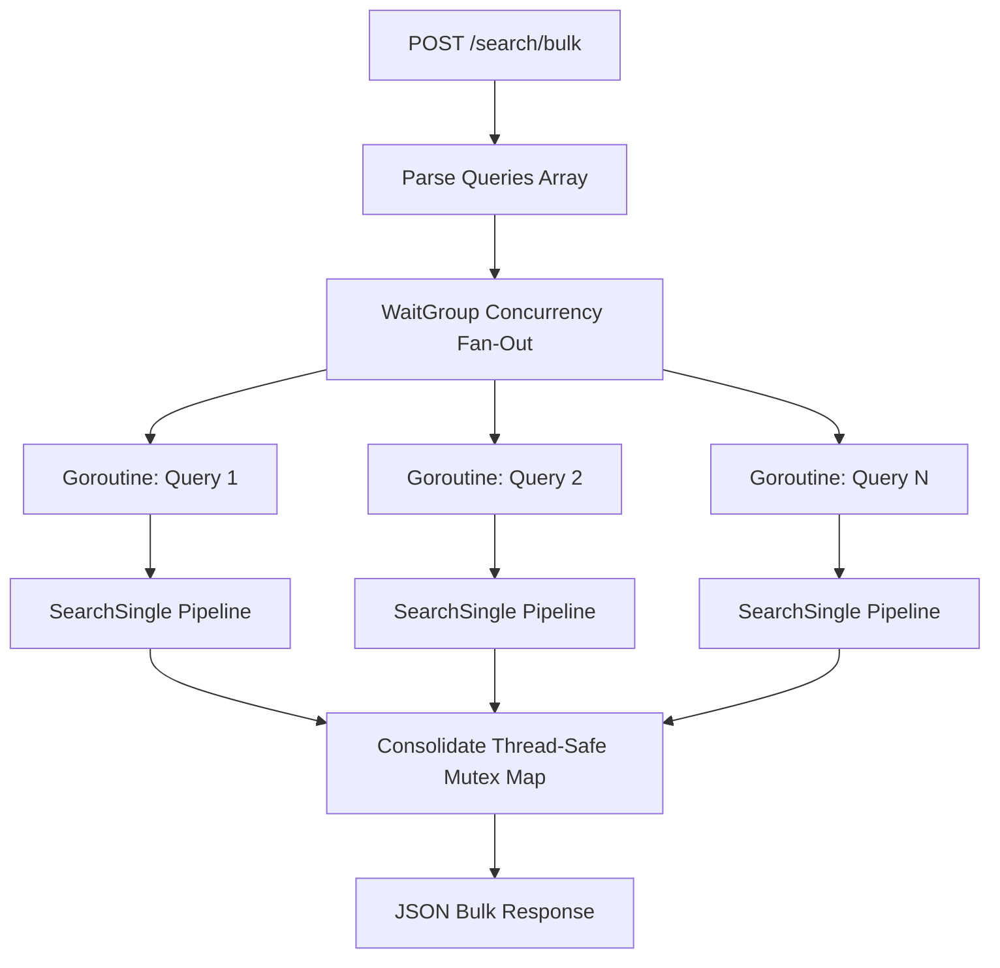

# 🚀 Concurrent Bulk Search (`POST /search/bulk`)

The bulk search feature enables clients to execute multiple distinct search queries in parallel concurrently. It is designed to bypass client-side rate limits and maximize proxy IP rotation throughput.

---

## 🏗️ Architecture

Bulk search splits queries across parallel Goroutines inside the backend, aggregating separate query results into a single consolidated JSON map response:



---

## ⚙️ How It Works

1. **DRY Pipeline Reuse**:
   * Refactored search execution into a clean `SearchSingle` method. Both `/search` and `/search/bulk` call `SearchSingle` to execute queries.
   * This guarantees that every query inside a bulk request is fully parsed for overrides (`!w`, `:fr`), checks caches, deduplicates, scores, filters exclusions (`-term`), and caches results individually.
2. **Goroutine Fan-Out Concurrency**:
   * Leverages a `sync.WaitGroup` to launch query executions in parallel.
   * Leverages a `sync.Mutex` to dynamically write single-query search outcomes safely into a shared `resultsMap` in a thread-safe manner.
3. **Dynamic Proxy Load Dispersion**:
   * Because all queries are run in parallel, their underlying engine scraper connections call our proxy rotator concurrently.
   * This fans out distinct queries across multiple rotated proxy IPs simultaneously, preventing engines from blocking the server.

---

## 💻 How to Use

* **Endpoint**: `POST /search/bulk`
* **Headers**:
  ```http
  Authorization: Bearer gosearx_sec_****_****_****
  Content-Type: application/json
  ```
* **Payload**:
  ```json
  {
    "queries": [
      "!w space exploration",
      "gosearx metasearch engine",
      "!gk quantum computing"
    ],
    "categories": ["general"],
    "locale": "en-US",
    "timeout": 4.0
  }
  ```

* **Response Schema**:
  ```json
  {
    "results": {
      "!gk quantum computing": {
        "results": [ ... results ... ],
        "unresponsive_engines": [],
        "count": 1
      },
      "!w space exploration": {
        "results": [ ... results ... ],
        "unresponsive_engines": [],
        "count": 1
      },
      "gosearx metasearch engine": {
        "results": [ ... results ... ],
        "unresponsive_engines": [],
        "count": 1
      }
    },
    "processing_time_ms": 234
  }
  ```
