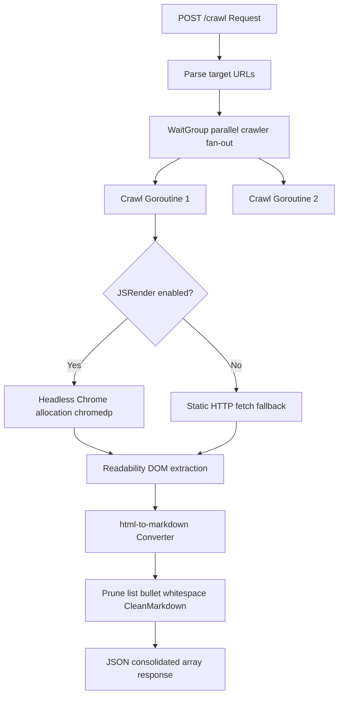

# 🕷️ Readability & Markdown Web Crawler

This feature provides GoSearX with high-fidelity, parallel article crawling and DOM extraction capabilities designed to convert webpages into clean, token-efficient Markdown for LLM/RAG consumption.

---

## 🏗️ Architecture

The crawler fans out target URL fetch requests, parses webpage structures using the smart Readability algorithm, and converts them into optimized markdown:



---

## ⚙️ How It Works

1. **Static and Dynamic Headless Rendering**:
   * **Static Fetch**: Standard HTTP client request mimicking modern organic browser headers.
   * **Dynamic Headless Render (JSRender)**: Spins up a Chrome browser allocator via `chromedp` to render SPA frameworks (React/Vue/Angular), injecting evasion scripts to mask `navigator.webdriver` bot fingerprints.
2. **Smart Article Readability Extraction**:
   * Utilizes the `go-readability` engine to isolate core content, strip out boilerplate DOM elements (headers, footers, sidebars, navigation panels), and capture lead image URLs, titles, and site excerpts.
   * Supports target CSS elements using `extract_selector` to scrape specific divs.
3. **Consolidated Markdown Conversion**:
   * Converts HTML structure to Markdown using the `html-to-markdown` engine.
   * Applies Crawl4AI-grade whitespace-cleaning rules: collapses multiple blank lines into standard dual newlines and prunes empty bullet points to minimize token counts.

---

## 💻 How to Use

* **Endpoint**: `POST /crawl`
* **Headers**:
  ```http
  Authorization: Bearer gosearx_sec_****_****_****
  Content-Type: application/json
  ```
* **Payload**:
  ```json
  {
    "urls": [
      "https://example.com/blog/1",
      "https://example.com/blog/2"
    ],
    "js_render": true,
    "wait_ms": 1000,
    "markdown": true
  }
  ```

* **Response Schema**:
  ```json
  {
    "results": [
      {
        "url": "https://example.com/blog/1",
        "title": "Example Blog Post 1",
        "excerpt": "A summary of the post...",
        "byline": "Author Name",
        "site_name": "Example Site",
        "length": 1240,
        "lead_image_url": "https://example.com/img1.jpg",
        "content": "Full text contents...",
        "markdown": "# Example Blog Post 1\n\nFull text in markdown format..."
      }
    ],
    "count": 1,
    "processing_time_ms": 1240
  }
  ```
