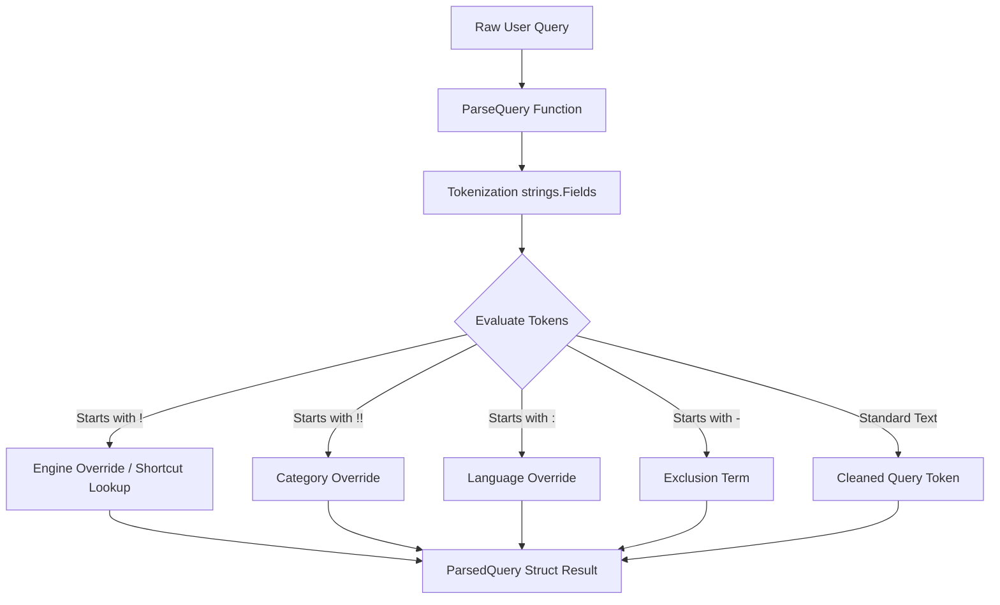

# 🔍 Dynamic Query Operators & Routing

This feature provides GoSearX with advanced inline query parsing and dynamic engine, category, language, and exclusion overrides, matching SearXNG's signature capabilities.

---

## 🏗️ Architecture

The parser lives entirely in the `engine` package and interacts directly with the `Registry` and server controllers:



---

## ⚙️ How It Works

1. **Tokenization**: The input query string is split into individual words (tokens) using `strings.Fields`.
2. **Sequential Evaluation**:
   * **Category Override (`!!category`)**: If a token starts with `!!`, the trailing characters are interpreted as a category name override (e.g., `!!science`). This overrides the default query categories.
   * **Engine Override (`!engine` or shortcut)**: If a token starts with `!`, the trailing characters are evaluated. If it matches a registered engine shortcut (like `w` for `wikipedia` or `gk` for `grokipedia`) or a registered engine name, that engine is registered in `EngineOverrides`.
   * **Language Override (`:language`)**: If a token starts with `:`, the trailing ISO 639-1 language code overrides the default locale language.
   * **Negative Exclusions (`-term`)**: If a token starts with `-`, the trailing word is added to `ExcludedTerms` for result filtering.
   * **Clean Query Rebuilding**: Any tokens that are not parsed as operators are joined together to form the `CleanQuery` search term.
3. **Aggregator Level Filtering**: The parsed `ExcludedTerms` are passed to `AggregateAndScore` inside the scoring layer. Any engine result matching an excluded term in a case-insensitive check against title or content snippet is deleted.

---

## 💻 How to Use

Simply include the operators inside your query string in `/search` or `/search/bulk` requests.

### Example REST Request:
```json
{
  "q": "!w Space Exploration -wikipedia :ja !!science",
  "categories": ["general"]
}
```

* **`!w`**: Forces the query to execute **only** on Wikipedia.
* **`Space Exploration`**: Rebuilt as the cleaned query target sent to Wikipedia.
* **`-wikipedia`**: Discards any Wikipedia result card containing the word "wikipedia" in its title or content snippet.
* **`:ja`**: Dynamically overrides search query regional parameters to Japanese (`ja`).
* **`!!science`**: (Ignored in this specific case because the engine override `!w` takes absolute routing precedence).
