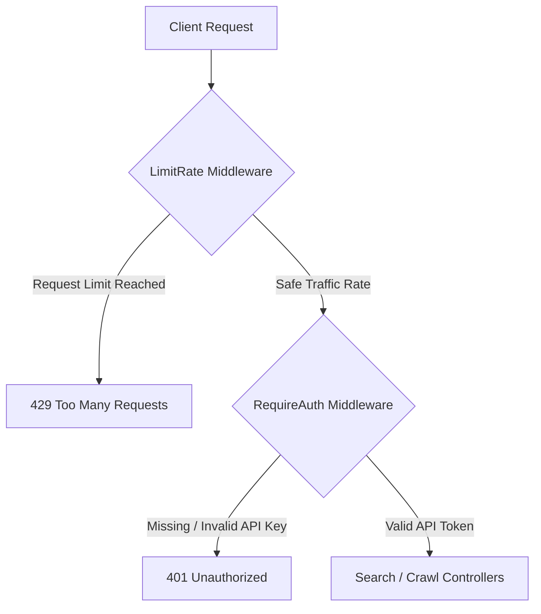

# 🛡️ Bot Limiter Shield & API Authentication

This feature provides GoSearX with a robust API gateway protecting the metasearch server from query floods, distributed bots, and unauthorized access.

---

## 🏗️ Architecture

The rate limiter resides as a middleware in `server/handlers.go` and intercepts requests before they hit the controller search layers:



---

## ⚙️ How It Works

1. **Authentic Client IP Extraction**:
   * The middleware extracts the client's IP address.
   * To prevent spoofing, it inspects proxy-routing headers (`X-Forwarded-For` and `X-Real-IP`) before falling back to `RemoteAddr`.
2. **High-Performance Sliding Window Rate Limiter**:
   * Uses GoSearX's configured caching layer (`InMemoryCache` or `RedisCache`).
   * When a request is received, it retrieves the client's rate-limiting key `"ratelimit:<IP>"`.
   * The cached value stores a JSON list of UnixNano timestamps of requests made in the current window.
   * Timestamps older than `10 seconds` are evicted.
   * If the remaining timestamps are $\geq 5$, the request is blocked and a `429 Too Many Requests` is returned.
   * Otherwise, the current timestamp is appended, the list is written back to the cache, and the request is allowed to proceed.
3. **Bearer Token Authentication**:
   * If API keys are configured, requests must provide a matching `Authorization` token header.
   * Invalid or missing tokens instantly abort request execution.

---

## 💻 How to Use

Configure API tokens and caching parameters inside `config/settings.yml`:

```yaml
general:
  api_keys:
    - "gosearx_sec_****_****_****"
  cache:
    enabled: true
    type: "redis" # "redis" or "inmemory"
    ttl: 300
```

### Test Rate Limiting
To test rate limiting manually, you can execute a curl command in rapid succession:

```bash
for i in {1..6}; do
  curl -o /dev/null -s -w "%{http_code}\n" -X POST http://localhost:8888/search \
    -H "Content-Type: application/json" \
    -H "Authorization: Bearer gosearx_sec_****_****_****" \
    -d '{"q": "quantum computing"}'
done
```

**Expected Output**:
```text
200
200
200
200
200
429
```
The 6th request will be blocked at the gateway level.
